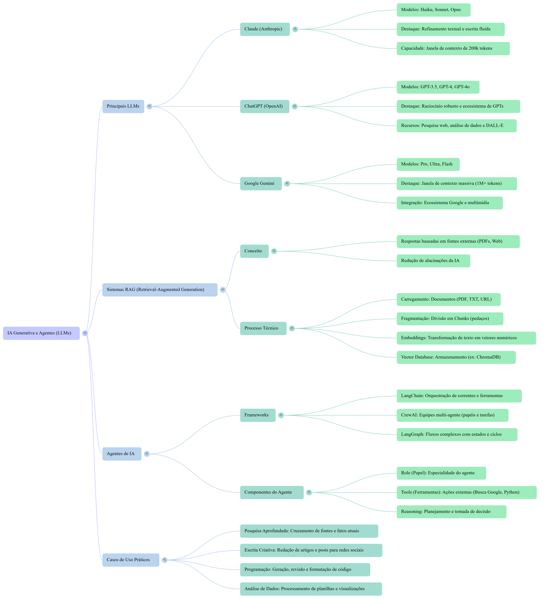
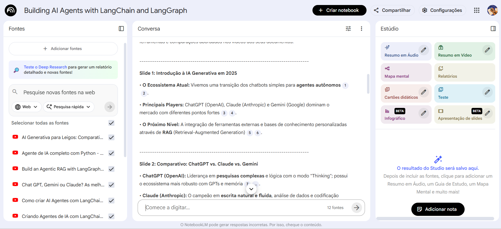

# 🧭 Projeto NotebookLM — Agentes Inteligentes com CrewAI, LangGraph e GenAI

Este projeto foi desenvolvido como uma experiência prática e estratégica para explorar o uso de agentes inteligentes autônomos com GenAI.  
A proposta é aplicar frameworks como **LangChain, LangGraph e CrewAI** em contextos reais de negócio e arquitetura técnica, organizando o conhecimento com metodologias como **PARA, Zettelkasten e Evergreen Notes**.

---

### 📊 NotebookLM Infográfico

Explica visualmente o ciclo ReAct, arquitetura RAG e frameworks usados

---

## 🧠 Visão Geral

Criar um **segundo cérebro estruturado** para organizar e conectar quatro pilares fundamentais:

1. 📌 Aplicações de agentes em negócios  
2. 🧠 Construção de agente RAG com LangGraph  
3. 📊 Comparativo entre Gemini, GPT e Claude  
4. 🧪 Estudo de caso CrewAI em ambiente multi-cloud  

---

## 🧩 Estrutura do Projeto

### 📌 Estudo de Caso - Agentes em Negócios
- Impacto em atendimento, vendas e análise de dados  
- **Fontes:** [Botpress](https://botpress.com/pt/blog/real-world-applications-of-ai-agents), [Target Soluções](https://targetsolucoes.com.br/alem-dos-chatbots-10-aplicacoes-estrategicas-de-agentes-de-ia-para-empresas/)

### 🧠 Projeto - Agente RAG com LangGraph
- Construção passo a passo com LangChain + LangGraph  
- **Fontes:** [LangChain Docs](https://docs.langchain.com/oss/python/langgraph/agentic-rag), [MongoDB Atlas](https://www.mongodb.com/pt-br/docs/atlas/ai-integrations/langgraph/build-agents/)

### 📊 Análise - Gemini vs GPT vs Claude
- Comparativo técnico e estratégico dos modelos  
- **Fontes:** [Eesel](https://www.eesel.ai/pt/blog/gpt-4o-vs-claude-3-vs-gemini-1-5), [Mindtek](https://www.mindtek.com.br/2025/12/qual-a-melhor-ia/)

### 🧪 Estudo de Caso - CrewAI Multi-Cloud
- Orquestração de agentes em ambiente escalável  
- **Fontes:** [DataCamp](https://www.datacamp.com/pt/tutorial/crew-ai), PDF técnico

---

## 💬 Interações com os Componentes

- **Agente com ReAct (Reasoning + Acting):**  
  Planeja, age e observa usando ferramentas como `search_tool`, `code_tool`, `api_tool`.

- **Arquitetura RAG:**  
  - Indexação de documentos  
  - Embeddings e busca vetorial  
  - Geração contextualizada com base em fontes externas  

- **Frameworks Integrados:**  
  - LangChain → estrutura de agentes  
  - LangGraph → fluxo cíclico e condicional  
  - CrewAI → equipes de especialistas com papéis definidos  

---

## 🧠 Metodologias Aplicadas

### PARA (Tiago Forte)
- **Projects:** os 4 pilares  
- **Areas:** GenAI, MLOps, Multi-cloud  
- **Resources:** vídeos, artigos, tutoriais  
- **Archives:** versões anteriores e insights aplicados  

### Zettelkasten (Niklas Luhmann)
- Conexões entre notas como:  
  - “RAG melhora precisão” ↔ “Claude tem janela de 200k”  
  - “CrewAI distribui tarefas” ↔ “LangGraph permite ciclos”  

### Evergreen Notes (Andy Matuschak)
- Notas atemporais como:  
  - “Agentes reduzem custos de atendimento”  
  - “Multi-cloud aumenta resiliência”  

---

### 🧠 NotebookLM Mind Map 

Representa a estrutura conceitual do projeto e suas conexões.

---

## 🖥️ Bastidores do Projeto 

Interface NotebookLM Captura de tela mostrando a organização de fontes, slides e ferramentas de síntese no NotebookLM. Utilizado para estruturar o conhecimento e gerar conteúdos visuais e analíticos. 

---

## 📘 Arquivos do Projeto

- 📄 **PDF Técnico:** Agentes Autônomos com LangChain e CrewAI  
- 🧠 **Infográfico:** IA Generativa e Agentes (LLMs)  
- 🌐 **Fontes externas:** Botpress, LangGraph Docs, CrewAI Tutorial  

---

## 🎯 Resultado Final

O projeto gerou uma estrutura completa de conhecimento e aplicação:

- Estudo de caso estratégico  
- Projeto técnico com LangGraph  
- Comparativo entre LLMs  
- Arquitetura multi-cloud com CrewAI  

Cada parte inclui:  
- Aplicações práticas  
- Frameworks utilizados  
- Ferramentas e fluxos  
- Casos de uso reais  

---

## 🔍 Funcionalidades do Sistema

1. **Agente Inteligente com ReAct**  
   - Planejamento e tomada de decisão  
   - Execução de tarefas com ferramentas externas  

2. **Planejamento Modular com LangGraph**  
   - Fluxos cíclicos e condicionais  
   - Controle total do estado e transições  

3. **Colaboração com CrewAI**  
   - Equipes de agentes especializados  
   - Divisão de tarefas complexas em subtarefas  

4. **Base de Conhecimento com RAG**  
   - Consulta em tempo real a documentos  
   - Geração contextualizada com precisão  

---

## 🧠 Reflexão

**O que funcionou bem:**  
- A separação entre frameworks e aplicações tornou o projeto modular e expansível.  
- Os infográficos e o PDF técnico enriqueceram a compreensão visual e conceitual.  

**O que pode evoluir:**  
- Criar uma interface interativa para visualizar os fluxos de agentes.  
- Transformar os estudos em APIs ou notebooks executáveis.  

**O que aprendi sobre agentes de IA:**  
- A IA vai além da conversa: ela planeja, decide e colabora.  
- Quanto mais contexto e ferramentas, mais poderosa e útil é a resposta.  

---

## 👨‍💻 Pessoa Desenvolvedor do Projeto / Project Developer

- [Rogerio](https://github.com/Rogerio5)
- [Ronaldo](https://github.com/Ronaldo94-GITHUB)

---

## ✅ Conclusão

Este projeto mostra como agentes inteligentes podem transformar processos técnicos e estratégicos.  
Ao combinar frameworks avançados com metodologias de organização cognitiva, criamos um sistema robusto para aprendizado, desenvolvimento e aplicação prática de GenAI.

